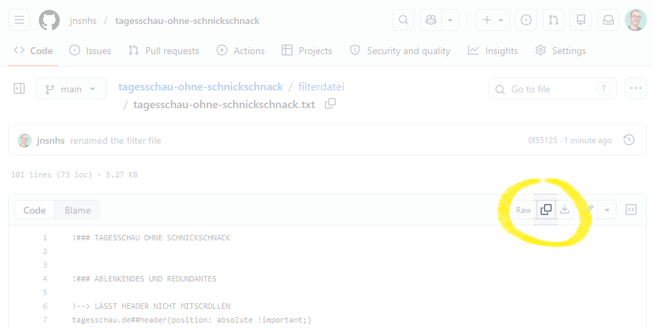
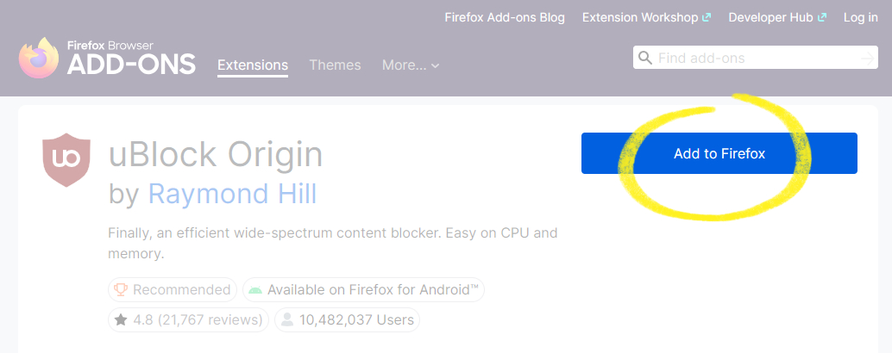
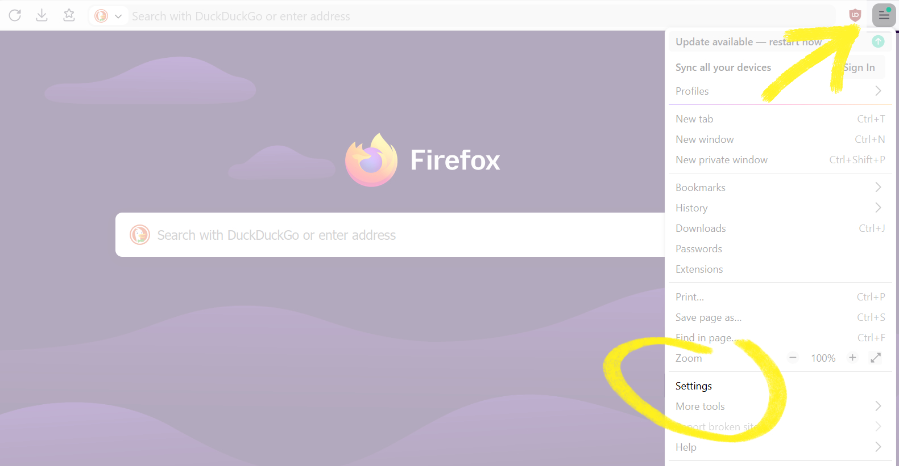
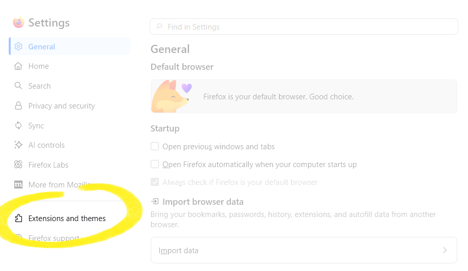
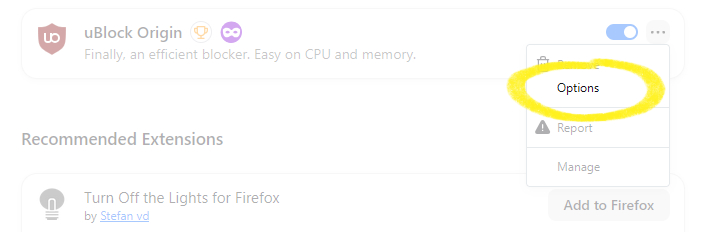
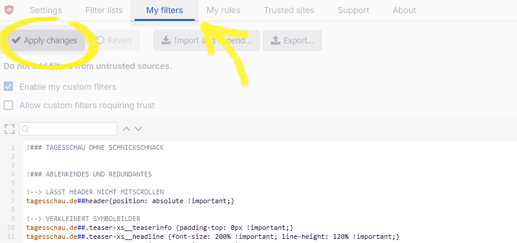

# Tagesschau ohne Schnickschnack


Die Internetseite der [Tagesschau](https://www.tagesschau.de/) ist seit vielen Jahren meine bevorzugte Nachrichtenquelle. Leider folgt sie – besonders seit dem Relaunch im Januar 2021 – einigen ärgerlichen Design-Trends, die den hochwertigen Inhalten zuwiderlaufen. Besonders auffällige Beispiele hierfür sind:

- Ein **fixierter Header** schränkt die Sichtbarkeit der Inhalte ein.
- Artikeltexte werden mehrfach von **Teaser-Absätze** unterbrochen.
- **Übergroße Symbolbilder** illustrieren selbst die kleinsten Meldungen.

Diese und weitere störende Gestaltungselemente können mit gezielten CSS-Filtern und der Browser-Erweiterung [uBlock Origin](https://github.com/gorhill/uBlock) korrigiert oder gleich ganz beseitigt werden. Auch die Sichtbarkeit von Inhalten wie Sport, Lotto oder Wetter lässt sich nach Belieben reduzieren. Dadurch gewinnt besonders die Hauptseite an Informationsdichte: Sie ist kompakter, schneller zu überblicken und wird zu einer „Tagesschau ohne Schnickschnack“.

**[➡️ DIREKT ZUR FILTERDATEI](./tagesschau-filter/tagesschau-ublock-filter.txt) (Stand: 2026-05-26)**


## Anleitung zur Einbindung

Die Einbindung der Filterdatei wird ausführlich am Beispiel von Firefox erläutert. Dieser Browser unterstützt sowohl in seiner Desktop- also auch in der Mobil-Version für Android die notwendige Extension *uBlock Origin* in vollem Umfang.

1. Rufen Sie die **Filterdatei** ([Link](./filterdatei/tagesschau-ohne-schnickschnack.txt)) auf und kopieren Sie ihren Inhalt in die Zwischenablage.



2. Sofern noch nicht vorhanden: Fügen Sie **uBlock Origin** ([Link](https://addons.mozilla.org/firefox/addon/ublock-origin/)) ihrem Browser hinzu. Nach der Installation sollte die Erweiterung als Icon neben der Adressleiste sichtbar sein.



3. Wählen Sie im Hauptmenü den Eintrag „**Einstellungen**“ (*Settings*):



3. In den Einstellungen klicken Sie auf **„Erweiterungen und Themes“** (*Extensions and Themes*):



5. Mit einem Klick auf die drei Punkte neben der Erweiterung uBlock Origin gelangen Sie in die „**Optionen**“:



6. Im Registerreiter **Meine Filter** (*My filters*) fügen Sie den Inhalt der Filterdatei aus der Zwischanblage ein. Mit einem abschließenden Klick auf **Änderungen übernehmen** (*Apply Changes*) speichern Sie die eingefügten Filter dauerhaft:




## Erläuterung der Filter

Die Datei `tagesschau-ohne-schnickschnack.txt` teilt die verschiedenen Filter in vier Kategorien auf:

- [Ablenkendes und Redundantes](#ablenkendes-und-redundantes): Diese Filter beziehen sich auf den eigentlichen *Schnickschnack*. Sie korrigieren misslungene Design-Entscheidungen undentfernen ausschließlich solche Inhalte von der Startseite, die dort *mehrfach* angezeigt werden.
- [Audio und Video](#audio-und-video): Filter in dieser Kategorie befreien die Startseite und die Ressort-Seiten (aber *nicht* die Artikelseiten) von Audio- und Video-Elementen. Nur dann sinnvoll, wenn Sie die Nachrichten ausschließlich lesen wollen.
- [Themen und Rubriken](#themen-und-rubriken): Inhalte, die nur eingeschränkten Nachrichtenwert haben (z.B. Wetter oder Sport), werden mit diesen Filtern entfernt. Hochgradig subjektiv, sollte individuell angepasst werden!
- [Social Media und Kommentare](#social-media-und-kommentare): Eine kleine Gruppe von Filtern, die Social-Media-Features von den Artikelseiten entfernt.

Nachfolgend werden alle Filter detailliert beschrieben, sodass Sie die Liste individuell anpassen und jene Filter, die Ihnen zu restriktiv erscheinen, gezielt löschen können.

### Ablenkendes und Redundantes

Ein **fixierter Header** verdeckt seit dem Relaunch im Januar 2021 dauerhaft einen Teil des Bildschirms; Abhilfe schafft die Änderung der CSS-Eigenschaft `position`:

```
tagesschau.de##header{position: absolute !important;}
```

Folgende Zeilen reduzieren die **Größe der Symbolbilder** und verkleinern auch die Typografie der angrenzenden Überschriften:

```
tagesschau.de##.teaser-xs__teaserinfo {padding-top: 0px !important;}
tagesschau.de##.teaser-xs__headline {font-size: 200% !important; line-height: 120% !important;}
tagesschau.de##.teaser-xs__topline {font-size: 150% !important;}
tagesschau.de##.teaser-xs__teaserinfo {width: 80% !important;}
tagesschau.de##.teaser-xs__media {display: block !important; margin-right: 0px !important; width: 20% !important;}
tagesschau.de##img.ts-image {max-height: 40rem !important; object-fit: cover !important;}
tagesschau.de##div.teaser__media {max-height: 40rem !important; overflow: hidden !important;}
tagesschau.de## article img.ts-image {max-height: initial !important; object-fit: cover !important;}
tagesschau.de##article div.teaser__media {max-height: initial !important; overflow: hidden !important;}
```

Die als **Teaser-Absätze** bezeichneten Unterbrechungen der Artikel verschwinden mit dieser Zeile:

```
tagesschau.de##article > div.copytext-element-wrapper:has(div.teaser-absatz)
```
In einer dunkelblauen „Promo-Box“ wird auf Startseite dauerhaft für das **ARD-Konto** geworben. Unnötig, sofern man daran kein Interesse hat:

```
tagesschau.de##div.teasergroup:has(h3.promo-box__primary-text:has-text(Ihr ARD-Konto))
```

Ein **Kurzüberblick** im oberen Bereich der Hauptseite enthält Verlinkungen zu Artikeln, die ohnehin im weiteren Verlauf der Seite zu finden sind:

```
tagesschau.de##div.teasergroup:has(div.trenner__text__topline:has-text(Die wichtigsten Nachrichten))
```

In einer überdimensioniert dargestellten **Top Ten** versammelt die Startseite die meistgeklickten Artikel. Auch hierbei handelt es sich nur um Verlinkungen zu Artikeln, die an anderer Stelle auf der Startseite bereits vorhanden sind:

```
tagesschau.de##div.teasergroup:has(div.trenner__text__topline:has-text(Meistgeklickt))
```

Die Ressort-Abschnitte auf der Hauptseite enthalten in ihrer unteren rechten Ecke in der Regel einen grauen Button, über den **weitere Meldungen** aus dem jeweiligen Ressort zu erreichen sind (z.B. „Weitere Inlandsmeldungen“). Weil die Titel der Ressorts die gleichen Verlinkungen besitzen und ebenfalls zu den Ressort-Hauptseiten führen, sind weitere Buttons in unmittelbarer Nähe überflüssig:

```
tagesschau.de##div.buttongroup:has-text(/Weitere .*meldungen/)
```

Auch der als **Back to Top** bezeichnete Button, der mit einem Klick zum Seitenanfang scrollt und sich immer wieder ein- und ausblendet, ist in meinen Augen störendes Beiwerk:

```
tagesschau.de##.back-to-top
```

### Audio und Video

Ein dunkelblauer Kasten in der Mitte der Hauptseite hält die letzten **Sendungen** der Tagesschau bereit, ist aber außerordentlich raumgreifend:

```
tagesschau.de##div.teasergroup:has(div.trenner__text__headline:has-text(Sendungen))
```

Im letzten Viertel der Hauptseite werden häufig  Podcast-Produktionen der ARD beworben. Wer **Podcasts** lieber über einen Client bezieht, blendet diese Hinweise aus:

```
tagesschau.de##div.teasergroup:has(div.trenner__text__headline:has-text(Podcasts))
tagesschau.de##div.layout-container:has(h1:has-text(Aktuelle Nachrichten Videos und Audios)) div.teasergroup:has(div.trenner__text__headline:has-text(Podcasts)) {display: initial !important;}
```

Unter der Überschrift **Live und Topthemen** sind im oberen Bereich der Hauptseite ausgewählte Videobeträge und Links zu Livestreams zu finden:

```
tagesschau.de##div.teasergroup:has(div.trenner__text__headline:has-text(LIVE UND TOPTHEMEN))
```

An einige Meldungen auf der Hauptseite sind Buttons angeheftet, die **Multimedia-Inhalte zum Thema** (d.h. Audio- und/oder Videobeiträge) öffnen:

```
tagesschau.de##div.teaser__medialinks:has-text(/.* zum Thema/)
```

Folgende Zeilen blenden die **Play-Buttons** in den Symbolbildern aus und entfernen zugleich die damit Verknüpften Videos. Diese Filter gelten nur für die Startseite, auf den Artikelseiten sind die Videos weiterhin abspielbar:

```
tagesschau.de##div.teaser--top div.v-instance {visibility: hidden !important;}
tagesschau.de##div.teaser--small div.v-instance {visibility: hidden !important;}
tagesschau.de##li.teaser-xs div.v-instance {visibility: hidden !important;}
```

### Themen und Rubriken

Sie halten nichts von Glückspiel? Dann benötigen Sie auch keinen Infokasten, der am Ende der Startseite über die Ziehung der **Lottozahlen** informiert:

```
tagesschau.de##div.teasergroup:has(div.trenner__text__headline:has-text(lotto))
```

Informationen über das kommende **Wetter** werden mit folgenden Filtern von der Startseite entfernt:

```
tagesschau.de##div.teasergroup:has(span.teaser__topline:has-text(Wettervorhersage Deutschland))
tagesschau.de##div.layout-container:has(h1:has-text(Wetter)) div.teasergroup:has(span.teaser__topline:has-text(Wettervorhersage Deutschland)) {display: initial !important;}
```

Meldungen, die sich auf den **Sport** (und das heißt in den meisten Fällen: Fußball) beziehen, sind in der Regel Verlinkungen zur [Sportschau](https://www.sportschau.de). Die Tagesschau besitzt daher auch keine eigene Sport-Rubrik. Ich persönlich halte reine Sportberichterstattung nicht für essentielle Nachrichten und blende sie daher aus:

```
tagesschau.de##div.teasergroup:has(span.link-extend__extern:has-text(sportschau))
tagesschau.de##div.teasergroup:has(span.link-extend__extern:has-text(sportschau)) + div.teasergroup--docked
tagesschau.de##div.teasergroup--docked:has(iframe[src*="sportschau"])
tagesschau.de##div.teasergroup--docked:has(iframe[src*="sportschau"]) + div.teasergroup--docked
tagesschau.de##div.teasergroup:has([href*="/sport/"])
tagesschau.de##div.teasergroup:has([href*="/sport/"]) + div.teasergroup--docked
tagesschau.de##div.teasergroup:has([src*="sportschau"])
tagesschau.de##div.teasergroup:has([src*="sportschau"]) + div.teasergroup--docked
```

Ähnlich subjektiv ist die Entscheidung, auf den **Marktbericht** und die daran geknüpften **Börsenkurse** sowie die aktuellen Zahlen der **Weltmärkte** zu verzichten:

```
tagesschau.de##div.teasergroup:has(div.trenner__text__headline:has-text(Marktbericht))
tagesschau.de##div.teasergroup:has(div.trenner__text__headline:has-text(Börsenkurse))
tagesschau.de##div.layout-container:has(h1:has-text(Wirtschaft und Börsen-Nachrichten)) div.teasergroup:has(div.trenner__text__headline:has-text(MARKTBERICHT)) {display: initial !important;}
tagesschau.de##div.layout-container:has(h1:has-text(Wirtschaft und Börsen-Nachrichten)) div.teasergroup:has(div.trenner__text__headline:has-text(Börsenkurse)) {display: initial !important;}
```

🚨 **Achtung, unbedingt selbst entscheiden:** Auch die Meldungen der Rubrik **Faktenfinder** entferne ich persönlich von der Startseite. Der Faktenfinder greift regelmäßig Gerüchte, Desinformationen, Propaganda sowie Hass und Hetze aus den sozialen Medien auf, um diese zu korrigieren oder zu widerlegen. Das ist grundsätzlich sehr lobenswert! Aber: Ich persönlich nutze soziale Medien bewusst nicht und erfahre erst *durch* den Faktenfinder detailliert davon, welcher Wahnsinn sich regelmäßig auf den einschlägigen Plattformen abspielt. Diesen Exkurs ersparen mir die folgenden Zeilen:

```
tagesschau.de##div.teasergroup:has(span.label--standard-primary:has-text(Faktenfinder))
tagesschau.de##div.teasergroup:has(div.trenner__text__headline:has-text(Faktenfinder))
tagesschau.de##div.layout-container:has(h1:has-text(faktenfinder - Fakten-Checks und Hintergründe)) div.teasergroup:has(span.label--standard-primary:has-text(Faktenfinder)) {display: initial !important;}
tagesschau.de##div.layout-container:has(h1:has-text(faktenfinder - Fakten-Checks und Hintergründe)) div.teasergroup:has(div.trenner__text__headline:has-text(Faktenfinder)) {display: initial !important;}
```

### Social Media und Kommentare

Wer soziale Medien nicht nutzt, benötigt auch keine bunten **Social Media Buttons**, die zum „Teile“ auffordern, am Ende jedes Artikels:

```
tagesschau.de##ul.socialbuttons__list
```

Und zuletzt blendet die folgende Zeile auf Artikelseiten den Button aus, der die **Kommentare zur Meldung** anzeigt:

```
tagesschau.de##.buttongroup__item:has(span.btn__label:has-text(Kommentare zur Meldung))
```
