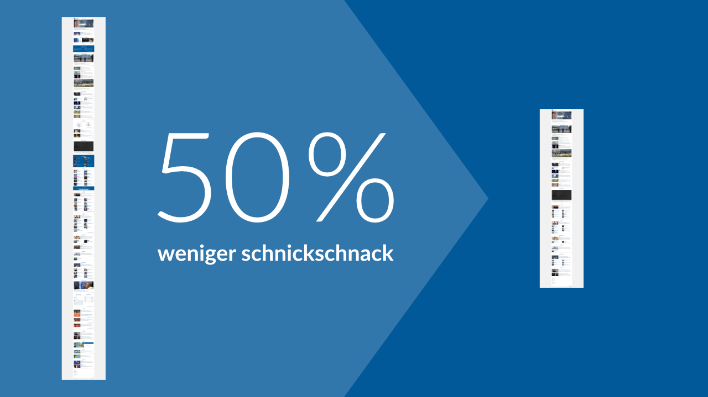

# Tagesschau ohne Schnickschnack

Die Internetseite der [Tagesschau](https://www.tagesschau.de/) ist seit vielen Jahren meine bevorzugte Nachrichtenquelle. Leider folgt sie – besonders seit dem Relaunch im Januar 2021 – einigen ärgerlichen Design-Trends, die den hochwertigen Inhalten zuwiderlaufen. Vorrangige Beispiele hierfür sind:

- Ein **fixierter Header** raubt den Inhalten wertvollen Platz.
- Artikeltexte werden mehrfach von **Teaser-Absätze** unterbrochen.
- **Übergroße Symbolbilder** illustrieren selbst die kleinsten Meldungen.

Diese und weitere störende oder ablenkende Gestaltungselemente können mit gezielten CSS-Filtern und der Browser-Erweiterung [uBlock Origin](https://github.com/gorhill/uBlock) korrigiert oder gleich ganz beseitigt werden. Dadurch gewinnt besonders die Hauptseite an Informationsdichte: Sie ist kompakter, schneller zu überblicken und wird zu einer „Tagesschau ohne Schnickschnack“.
