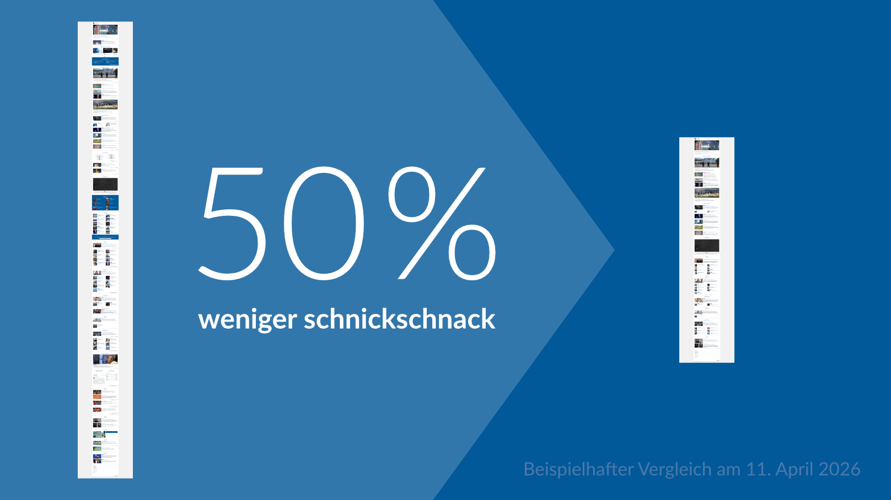
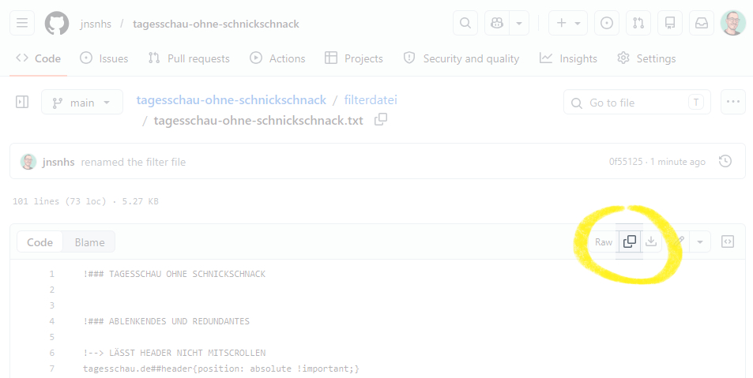
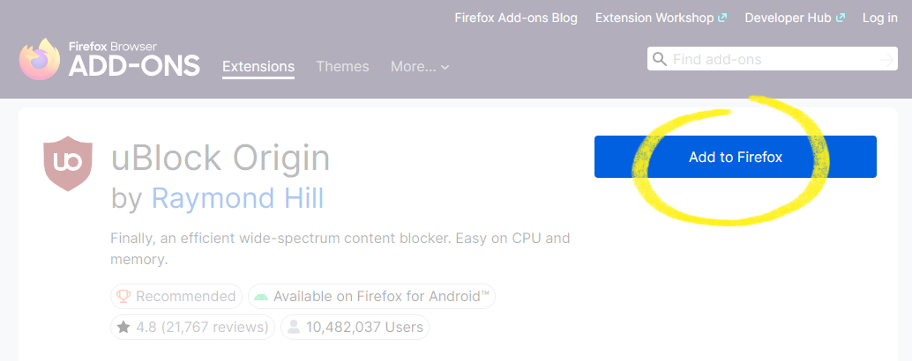
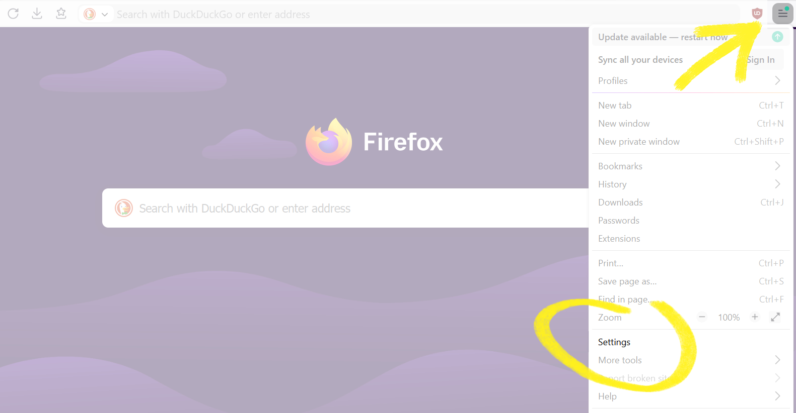
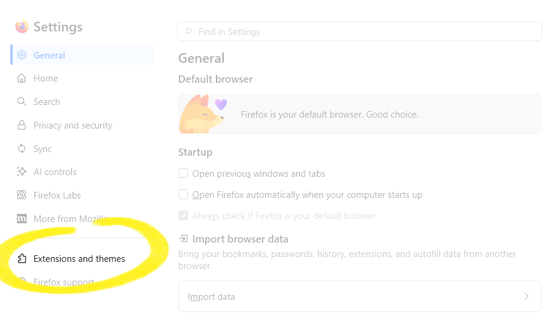
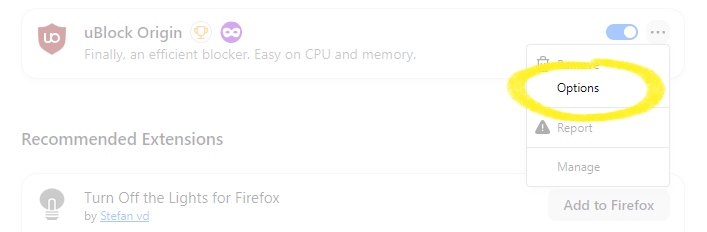
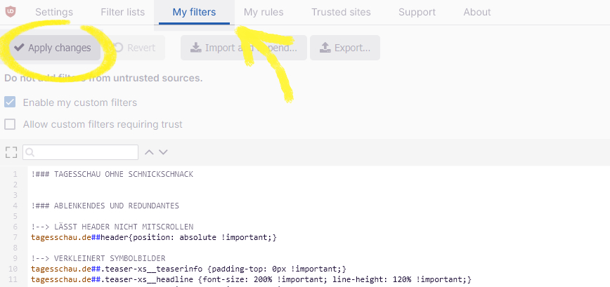

# Tagesschau ohne Schnickschnack

Die Internetseite der [Tagesschau](https://www.tagesschau.de/) ist seit vielen Jahren meine bevorzugte Nachrichtenquelle. Leider folgt sie – besonders seit dem Relaunch im Januar 2021 – einigen ärgerlichen Design-Trends, die den hochwertigen Inhalten zuwiderlaufen. Besonders auffällige Beispiele hierfür sind:

- Ein **fixierter Header** schränkt die Sichtbarkeit der Inhalte ein.
- Artikeltexte werden mehrfach von **Teaser-Absätze** unterbrochen.
- **Übergroße Symbolbilder** illustrieren selbst die kleinsten Meldungen.

Diese und weitere störende Gestaltungselemente können mit gezielten CSS-Filtern und der Browser-Erweiterung [uBlock Origin](https://github.com/gorhill/uBlock) korrigiert oder gleich ganz beseitigt werden. Auch die Sichtbarkeit von Inhalten wie Sport, Lotto oder Wetter lässt sich nach Belieben reduzieren. Dadurch gewinnt besonders die Hauptseite an Informationsdichte: Sie ist kompakter, schneller zu überblicken und wird zu einer „Tagesschau ohne Schnickschnack“.

**[➡️ DIREKT ZUR FILTERDATEI](./filterdatei/tagesschau-ohne-schnickschnack.txt) (Stand: 2026-06-11)**

## Anleitung zur Einbindung

Die Einbindung der Filterdatei wird ausführlich am Beispiel von Firefox erläutert. Dieser Browser unterstützt sowohl in seiner Desktop- also auch in der Mobil-Version für Android die notwendige Extension *uBlock Origin* in vollem Umfang.

1. Rufen Sie die **Filterdatei** ([Link](./filterdatei/tagesschau-ohne-schnickschnack.txt)) auf und kopieren Sie den Inhalt in die Zwischenablage.

2. Sofern noch nicht vorhanden: Fügen Sie **uBlock Origin** ([Link](https://addons.mozilla.org/firefox/addon/ublock-origin/)) ihrem Browser hinzu. Nach der Installation sollte die Erweiterung als Icon neben der Adressleiste sichtbar sein.

3. Wählen Sie im Hauptmenü den Eintrag „**Einstellungen**“ (*Settings*):

3. In den Einstellungen klicken Sie auf **„Erweiterungen und Themes“** (*Extensions and Themes*):

5. Mit einem Klick auf die drei Punkte neben der Erweiterung uBlock Origin gelangen Sie in die „**Einstellungen**“ (*Options*):

6. Im Registerreiter **„Meine Filter“** (*My filters*) fügen Sie den Inhalt der Filterdatei aus der Zwischanblage ein. Mit einem abschließenden Klick auf **„Änderungen übernehmen“** (*Apply Changes*) speichern Sie die eingefügten Filter dauerhaft:

Fertig! Die Tagesschau präsentiert sich nun aufgeräumt, kompakt und übersichtlich – ganz ohne Schnickschnack.

> [!Note]
> In der [ausführlichen Erläuterung](./doc/documentation.md) erkläre ich im Detail, was die einzelnen Blöcke der Filterdatei bewirken und wie sie individuell angepasst werden können. Entscheiden Sie selbst, was Schnickschnack ist und was nicht.
